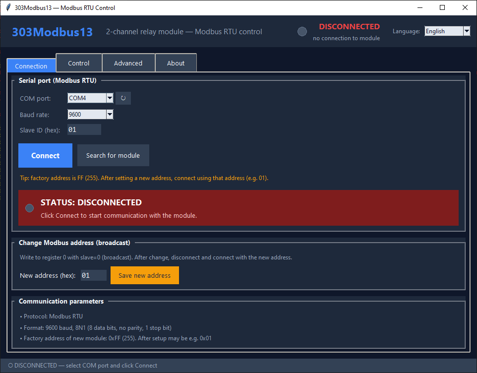
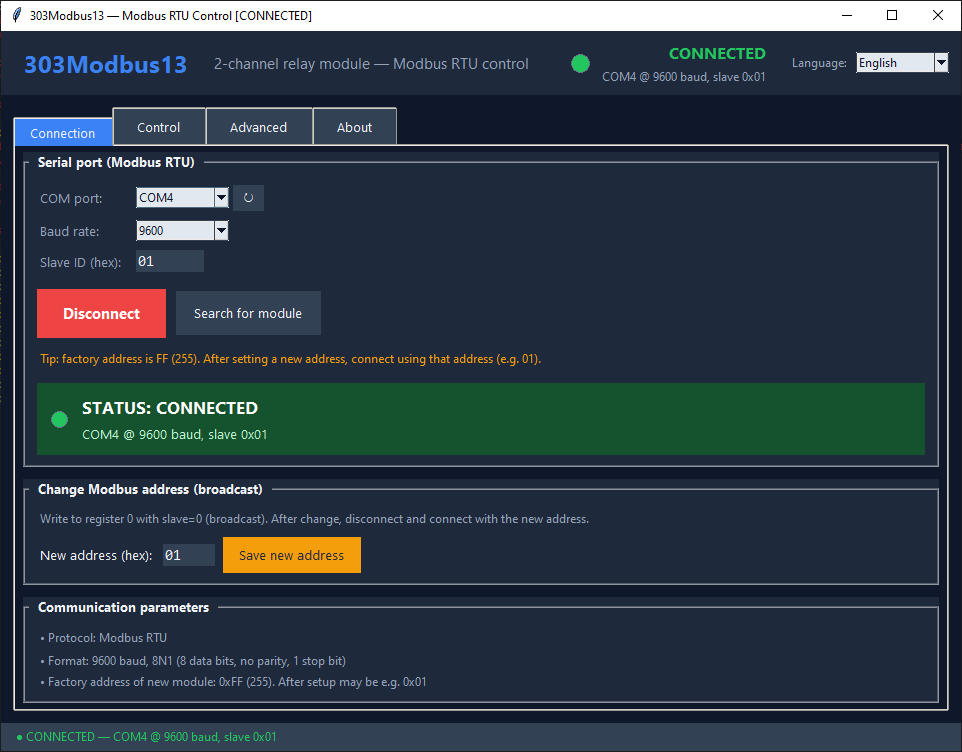
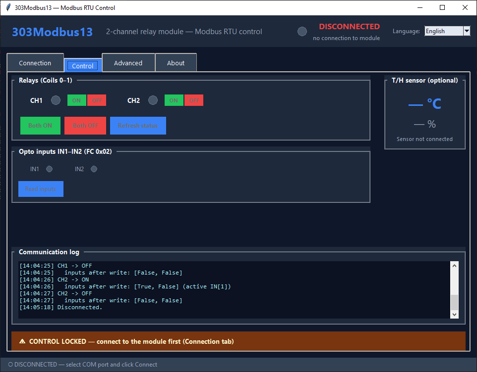
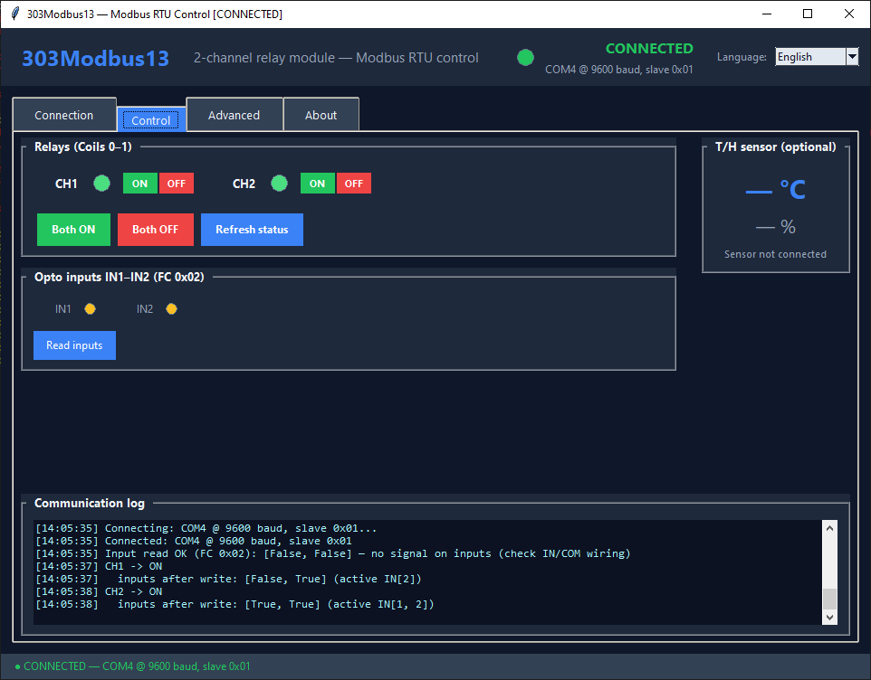
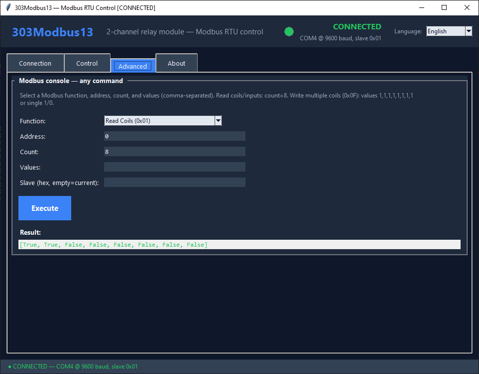
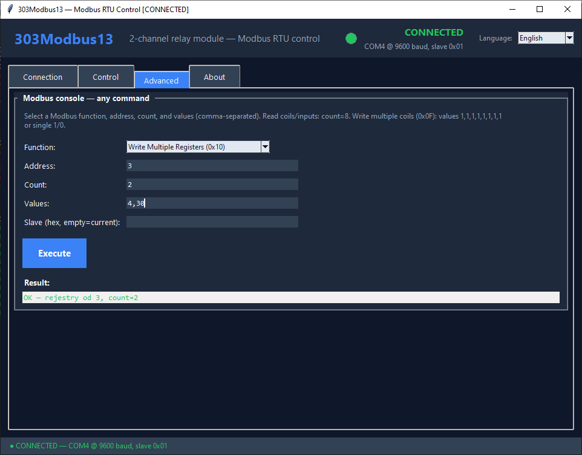
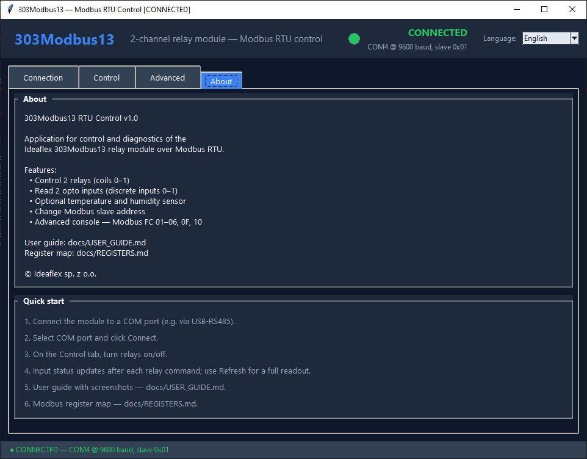

# 303Modbus13 RTU Control — User Guide

Step-by-step instructions for the desktop application that controls the **Ideaflex 303Modbus13** relay module over **Modbus RTU**.

For register addresses, timeouts, and wiring details see **[REGISTERS.md](REGISTERS.md)**.

Use the screenshots in each section to find the matching buttons and fields in the application window.

### Language

In the top-right corner of the window, use the **Language** dropdown to switch between **English** and **Polish**. The choice is saved in `settings.json` for the next launch. For documentation screenshots, select **English**.

---

## 1. Before you start

| Item | Typical value |
|------|---------------|
| Connection | USB-RS485 converter (e.g. CH340) |
| COM port | e.g. `COM4` (check Device Manager) |
| Baud rate | `9600`, format **8N1** |
| Factory Slave ID | `FF` (255 decimal) |
| Relays | CH1, CH2 (coils 0-1) |
| Opto inputs | IN1, IN2 (discrete inputs 0-1) |

Wire the module: RS-485 **A to A**, **B to B**, power supply. For opto inputs connect **COM to signal GND** and **INx to +12-24 V** (see REGISTERS.md).

Run the application:

```bash
python app.py
```

---

## 2. Connection tab

Before connecting (select COM port and Slave ID):



After a successful connection (green status banner):



### Connect to the module

1. Plug in the USB-RS485 adapter and note the COM port in **Device Manager**.
2. Select **Port COM** (e.g. `COM4`). Click the refresh button if the port is not listed.
3. Set **Baud rate** to `9600`.
4. Set **Slave ID (hex)** to `FF` for a new module (factory address).
5. Click **Connect**.

When connected, the status bar and banner turn green (**CONNECTED**) with details such as `COM4 @ 9600 baud, slave 0xFF`.

### Find module automatically

Click **Search for module**. The app scans COM ports, baud rates, and common Slave IDs. If found, port and Slave ID are filled in automatically.

### Change Modbus address

Use this only with **one module** on the bus:

1. Stay connected with the current address (usually `FF`).
2. In **New address (hex)** enter the new ID, e.g. `01`.
3. Click **Save new address** — this sends FC `0x10` with Slave = `0` (broadcast).
4. **Disconnect**, set Slave ID to the new value (`01`), and **connect** again.

---

## 3. Control tab

When disconnected, controls are locked until you connect on the Connection tab:



When connected, relays and inputs are active. The log shows commands and automatic input reads after each coil write:



### Relays

| Control | Action |
|---------|--------|
| **ON / OFF** per channel | Toggle CH1 or CH2 |
| **Both ON** | Turn both relays on (FC `0x0F`, 8 coils in frame) |
| **Both OFF** | Turn both relays off |
| **Refresh status** | Refresh relay, input, and optional T/H sensor state |

The LED next to each channel is **green** when the relay is ON, **grey** when OFF.

After each relay operation the app reads opto inputs automatically and shows the result in the log.

### Opto inputs

| Element | Meaning |
|---------|---------|
| **IN1 / IN2** LED | **Yellow** = active input, **grey** = inactive |
| **Read inputs** | Manual read (FC `0x02`) |

Example log line when IN2 is active:

`Input read OK (FC 0x02): [False, True] - active: IN2`

### Optional T/H sensor

If a temperature/humidity sensor is installed (Slave ID `02`), values appear in the right panel. Otherwise you will see **Sensor not connected** — this is normal.

Input LEDs update automatically after each relay command (ON/OFF, Both ON/OFF). Use **Refresh** for a manual full readout, or **Read inputs** for inputs only.

### Communication log

The bottom **Communication log** panel records connections, relay commands, input reads, and errors. Use it for quick diagnosis.

---

## 4. Advanced tab



The **Modbus console** sends raw Modbus frames for testing and integration work.

| Field | Description |
|-------|-------------|
| **Function** | Modbus function (FC 0x01-0x06, 0x0F, 0x10) |
| **Address** | Start address |
| **Count** | Number of items (for reads / write_coils length) |
| **Values** | Comma-separated values for write functions (`0` / `1` for coils) |
| **Slave** | Hex Slave ID; leave empty to use the connected address |
| **Execute** | Run the command |
| **Result** | Response or error message |

### Example commands

| Goal | Function | Address | Count | Values | Slave |
|------|----------|---------|-------|--------|-------|
| Read relays | Read Coils (0x01) | 0 | 8 | - | empty |
| Read inputs | Read Discrete Inputs (0x02) | 0 | 8 | - | empty |
| CH1 ON | Write Single Coil (0x05) | 0 | 1 | 1 | empty |
| Both ON | Write Multiple Coils (0x0F) | 0 | 8 | 1,1,1,1,1,1,1,1 | empty |
| Set address 1 | Write Multiple Registers (0x10) | 0 | 1 | 1 | 0 |
| CH1 ON 3 s, then auto OFF | Write Multiple Registers (0x10) | 3 | 2 | 4,30 | empty |

### Delayed relay switching (verified on hardware)

The module supports timed pulses in addition to immediate ON/OFF. Use **FC 0x10** on holding-register blocks — **not** the coil addresses used by the Control tab.



**Screenshot above:** connected at Slave `01`, command **Write Multiple Registers (0x10)**, Address **`3`**, Count **`2`**, Values **`4,30`**.

**Effect on CH1:** relay turns **ON immediately**, then turns **OFF automatically after 3.0 s** (`30 × 0.1 s`). If NO1 is wired to IN1, you will see IN1 go active while the relay is on.

| Field | CH1 (3 s pulse ON) | CH2 (3 s pulse ON) |
|-------|--------------------|--------------------|
| Function | Write Multiple Registers (0x10) | same |
| Address | `3` | `8` |
| Count | `2` | `2` |
| Values | `4,30` | `4,30` |
| Slave | empty (uses connected ID) | same |

**Delay modes** (first value in `Values`; second value = time in **0.1 s** units, range 1–65535):

| Mode | Value | Behaviour |
|------|-------|-----------|
| **Pulse ON** | `4` | Relay **ON** → auto **OFF** after delay |
| **Pulse OFF** | `2` | Relay **OFF** → auto **ON** after delay |
| **Manual** | — | Use FC `0x05` / `0x0F` on coil addresses `0` / `1` (Control tab) — immediate, no timer |

Only modes **`2`** and **`4`** are used for delayed switching. There are no other documented timer modes on this module.

**More examples:**

| Goal | Address | Values | Time |
|------|---------|--------|------|
| CH1 ON 2 s, then OFF | `3` | `4,20` | 2.0 s |
| CH1 OFF 5 s, then ON | `3` | `2,50` | 5.0 s |
| CH2 ON 1 s, then OFF | `8` | `4,10` | 1.0 s |

Full register map: **[REGISTERS.md](REGISTERS.md)** (section *Delayed switching*).

**Tips:**

- Use **count = 8** for reading coils and discrete inputs on this module.
- For **Write Multiple Coils**, you can enter a single value `1` or `0` — it will be expanded to 8 coils.
- Wait until any other operation finishes before clicking **Execute** (or click **Cancel** on the Connection tab).

---

## 5. About tab



Shows application version, feature list, and a short quick-start checklist. Full documentation:

| Document | Content |
|----------|---------|
| [USER_GUIDE.md](USER_GUIDE.md) | This guide (screenshots and UI instructions) |
| [REGISTERS.md](REGISTERS.md) | Modbus register map, timeouts, wiring |
| [README.md](../README.md) | Installation and project overview |

---

## 6. Quick troubleshooting

| Symptom | What to check |
|---------|----------------|
| Cannot connect | Correct COM port, cable A/B, Slave ID `FF` or `01`, close other apps using the port |
| Timeout | Use 9600 8N1; module needs ~3 s timeout (set in app backend) |
| Relays work, inputs always off | Wire **COM to GND** and **INx to +signal** on the module (not only on relay contacts) |
| Both ON/OFF does nothing | Ensure you are connected; check log for errors |
| Console does nothing | Another operation may be in progress — wait or cancel |
| T/H sensor missing | Optional hardware — ignore if not installed |

---

## 7. Contact

If you have any problems or questions, contact **FlexTech_KRK** on [Allegro](https://allegro.pl) or email **[biuro@ideaflex.pl](mailto:biuro@ideaflex.pl)**.

---

*303Modbus13 RTU Control — MIT License*
